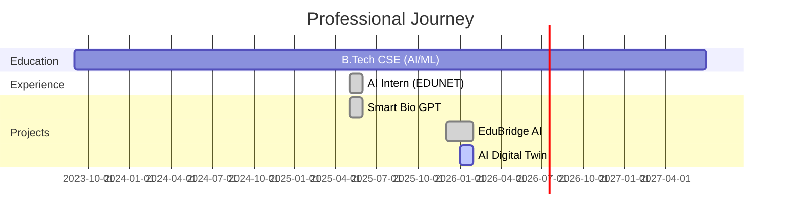
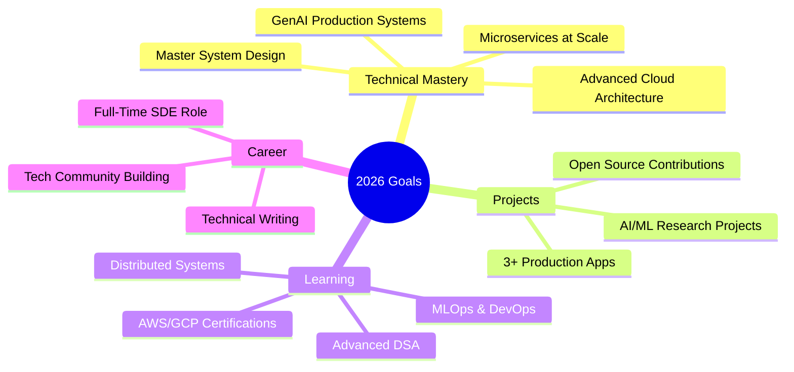
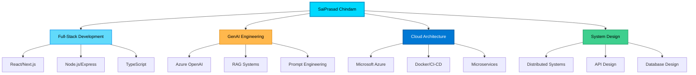

<div align="center">
  
[](https://git.io/typing-svg)

<p align="center">
  
  
  
</p>

<p align="center">
  <a href="https://github.com/saiprasad367">
    
  </a>
  <a href="https://www.linkedin.com/in/saiprasad2523/">
    
  </a>
  <a href="mailto:saiprasad2523@gmail.com">
    
  </a>
  <a href="https://leetcode.com/u/saiprasad2518/">
    
  </a>
  <a href="https://drive.google.com/file/d/10LhlwbpqALxGnD-2bXHtN2xce9y1zsqX/view?usp=sharing">
    
  </a>
</p>


</div>

---

<div align="center">

## 🚀 About Me


</div>

```typescript
const SaiPrasad = {
    role: "Software Engineer / GenAI Engineer",
    location: "Hyderabad, India 🇮🇳",
    education: "B.Tech CSE (AI/ML) @ CMR College",
    cgpa: "8.2 / 10",
    
    currentFocus: [
        "🤖 Building GenAI-powered production systems",
        "☁️ Cloud-native architecture on Azure",
        "🔒 Secure, scalable backend services",
        "🎯 Human-in-the-loop AI workflows"
    ],
    
    workingOn: "AI Digital Twin Platforms",
    learning: "Advanced System Design & Microservices",
    
    philosophy: `
        "Engineering is not just about writing code.
         It's about designing systems that survive reality."
    `
};
```

<div align="center">
  
</div>

---

## 🎯 What I Do

<table>
<tr>
<td width="50%" valign="top">

### 🧠 GenAI Engineering
```python
skills = {
    "GenAI": ["Azure OpenAI", "Prompt Engineering"],
    "RAG": ["FAISS", "Vector Search"],
    "AI_Ethics": ["Human-in-Loop", "Responsible AI"],
    "Learning": ["Adaptive Systems", "ML Analytics"]
}
```

</td>
<td width="50%" valign="top">

### ☁️ Cloud-Native Systems
```javascript
const cloud = {
    platform: "Microsoft Azure",
    services: [
        "Azure OpenAI",
        "Azure ML",
        "Cosmos DB",
        "App Services"
    ],
    devops: ["Docker", "CI/CD"]
};
```

</td>
</tr>
<tr>
<td width="50%" valign="top">

### 🎨 Full-Stack Development
```jsx
const stack = {
    frontend: ["React.js", "Next.js", "TypeScript"],
    backend: ["Node.js", "Express.js", "FastAPI"],
    database: ["MongoDB", "PostgreSQL", "Firebase"],
    auth: "JWT + OAuth"
};
```

</td>
<td width="50%" valign="top">

### 🏗️ System Design
```go
type Engineer struct {
    Focus []string{
        "Microservices Architecture",
        "Distributed Systems",
        "API Design",
        "Performance Optimization",
        "Security Best Practices"
    }
}
```

</td>
</tr>
</table>

<div align="center">
  
</div>

---

## 💻 Tech Stack

<div align="center">

### 👨‍💻 Programming Languages


### 🎨 Frontend Development


### ⚙️ Backend Development


### 🤖 AI & Machine Learning


### ☁️ Cloud & DevOps


### 🗄️ Databases


### 🛠️ Tools & Platforms


</div>

<div align="center">
  
</div>

---

## 🚀 Featured Projects

<div align="center">

<table>
<tr>
<td width="50%">

### 🎓 EduBridge AI
**Voice-First GenAI Learning Platform**


**🎯 Key Features:**
- 🎙️ Speech-to-Text → GenAI → Text-to-Speech pipeline
- 🔄 Adaptive learning loop (Explain → Ask → Analyze)
- 📊 ML-based scoring for clarity & confidence
- ☁️ Cloud-native with Cosmos DB persistence

**💡 Impact:** Personalized multilingual learning at scale

</td>
<td width="50%">

### 🏥 AI Digital Twin Platform
**Medical System Engineering**


**🎯 Key Features:**
- 🧬 GenAI + RAG requirements-to-architecture pipeline
- 🔬 Digital twin simulation engine
- ✅ ISO-inspired compliance & safety framework
- 📤 Structured export (JSON/CSV) for integration

**💡 Impact:** Early risk detection & design optimization

</td>
</tr>
<tr>
<td width="50%">

### 🧬 Smart Bio GPT
**AI Bioinformatics Assistant**


**🎯 Key Features:**
- 💬 ChatGPT-style interface for gene/protein data
- 🔗 Multi-API integration (UniProt, AlphaFold, DrugBank)
- 🧊 3D protein visualization with Three.js
- 🔐 JWT authentication & secure API handling

**💡 Impact:** Real-time biomedical insights for researchers

[](https://smart-bio-gpt-tau.vercel.app)
[](https://github.com/saiprasad367/SmartBioGPT)

</td>
<td width="50%">

### 📚 More Projects

**Coming Soon:**
- 🤖 AI-powered automation tools
- 🌐 Full-stack web applications
- ☁️ Cloud-native microservices
- 🔐 Security-first backend systems

**Explore More:**
[](https://github.com/saiprasad367?tab=repositories)

</td>
</tr>
</table>

</div>

<div align="center">
  
</div>

---

## 📊 GitHub Analytics

<div align="center">
  


</div>

### 📈 Contribution Graph

<div align="center">
  
</div>

<div align="center">
  
[](https://github.com/ashutosh00710/github-readme-activity-graph)

</div>

### 🏆 GitHub Trophies

<div align="center">
  
</div>

<div align="center">
  
</div>

---

## 💼 Experience

<div align="center">



</div>

### 💼 EDUNET FOUNDATION | AI Intern
**May 2025 – Jun 2025 | Remote**


- ✅ Completed 4-week industry-aligned AI internship on Microsoft Azure
- 🤖 Built ML pipelines for classification & regression
- 🔗 Integrated GenAI APIs into web prototypes
- ☁️ Deployed cloud-based AI systems

<br clear="right"/>

<div align="center">
  
</div>

---

## 🧩 Problem Solving

<div align="center">

<table>
<tr>
<td align="center" width="33%">

<br><br>
<b>LeetCode</b>
<br><br>

<br>
<a href="https://leetcode.com/u/saiprasad2518/">
  
</a>
</td>
<td align="center" width="33%">

<br><br>
<b>Focus Areas</b>
<br><br>
• Data Structures<br>
• Algorithms<br>
• System Design<br>
• Problem Solving
</td>
<td align="center" width="33%">

<br><br>
<b>Practice Level</b>
<br><br>


</td>
</tr>
</table>


</div>

<div align="center">
  
</div>

---

## 🏆 Certifications & Achievements

<div align="center">

<table>
<tr>
<td width="50%">

### 🎓 Professional Certifications

✅ **Salesforce Certified Agentforce Specialist**  
✅ **Microsoft AICTE Internship** — AI on Azure  
✅ **Google GDG Solution Challenge 2025**  
✅ **Scaler** — High-Level Design (OTT Scale)  
✅ **Cisco** — Introduction to Cybersecurity  
✅ **Cisco** — Introduction to Modern AI  

</td>
<td width="50%">

### 🌟 Additional Credentials

✅ **Hexart** — AI Advanced/Beginner/Foundation  
✅ **Deloitte** — Technology & Cybersecurity Simulations  
✅ **Cisco** — Introduction to Data Science  
✅ **HackerRank** — SQL, Java, Problem Solving  
✅ **CodeClash** — DSA Challenge  
✅ **Manipal** — BuildFolio Hackathon  

</td>
</tr>
</table>

</div>

<div align="center">
  
</div>

---

## 🎓 Education

<div align="center">

```javascript
const education = {
    current: {
        degree: "Bachelor of Technology",
        specialization: "Computer Science (AI & ML)",
        institution: "CMR College of Engineering & Technology",
        location: "Hyderabad, India",
        duration: "Sep 2023 - Present",
        cgpa: "8.2 / 10",
        focus: ["GenAI Systems", "Cloud Architecture", "System Design"]
    },
    
    previous: {
        intermediate: {
            college: "Shivani Junior College",
            stream: "MPC (Maths, Physics, Chemistry)",
            duration: "2021 - 2023",
            grade: "97.7%",
            achievement: "🏆 Top Performer"
        },
        
        school: {
            name: "Sri Siddhartha High School",
            grade: "Grade 10 / SSC",
            achievement: "Strong Academic Foundation"
        }
    }
};
```

</div>

<div align="center">
  
</div>

---

## 🌐 Connect With Me

<div align="center">

<table>
<tr>
<td align="center" width="25%">
<a href="https://github.com/saiprasad367">

<br><b>GitHub</b>
<br>@saiprasad367
</a>
</td>
<td align="center" width="25%">
<a href="https://www.linkedin.com/in/saiprasad2523/">

<br><b>LinkedIn</b>
<br>@saiprasad2523
</a>
</td>
<td align="center" width="25%">
<a href="mailto:saiprasad2523@gmail.com">

<br><b>Email</b>
<br>saiprasad2523@gmail.com
</a>
</td>
<td align="center" width="25%">
<a href="https://leetcode.com/u/saiprasad2518/">

<br><b>LeetCode</b>
<br>@saiprasad2518
</a>
</td>
</tr>
</table>

<br>

[](https://www.linkedin.com/in/saiprasad2523/)
[](https://github.com/saiprasad367)
[](mailto:saiprasad2523@gmail.com)
[](https://leetcode.com/u/saiprasad2518/)
[](https://drive.google.com/file/d/10LhlwbpqALxGnD-2bXHtN2xce9y1zsqX/view?usp=sharing)

</div>

<div align="center">
  
</div>

---

## 💭 Philosophy

<div align="center">

```python
class EngineeringPhilosophy:
    def __init__(self):
        self.beliefs = {
            "code_quality": "Write code humans can understand",
            "system_design": "Design for failure, build for scale",
            "ai_ethics": "Human-in-loop is not optional",
            "continuous_learning": "Stay curious, stay humble",
            "impact": "Build systems that survive reality"
        }
    
    def motto(self):
        return """
        💡 Engineering is not just about writing code.
        🏗️ It's about designing systems that survive reality.
        🚀 From idea to production, make it count.
        """

philosophy = EngineeringPhilosophy()
print(philosophy.motto())
```

</div>

<div align="center">
  
</div>

---

## 🎯 2026 Goals

<div align="center">



</div>

<div align="center">

### ✨ Current Streak


</div>

---

## 🎨 Skills Visualization

<div align="center">



</div>

---

## 💖 Support My Work

<div align="center">

If you find my work helpful or interesting, consider:

⭐ **Starring** my repositories  
🔗 **Connecting** on LinkedIn  
☕ **Sharing** with your network  
📧 **Reaching out** for collaborations  

<br>

<a href="https://github.com/saiprasad367">
  
</a>
<a href="https://github.com/saiprasad367">
  
</a>

</div>

<div align="center">
  
</div>

---

## 🎭 Fun Facts

<div align="center">

```javascript
const funFacts = {
    currentlyLearning: "Advanced System Design & MLOps",
    askMeAbout: ["GenAI", "Cloud Architecture", "Full-Stack", "DSA"],
    funFact: "I debug with console.log and I'm not ashamed! 😄",
    motto: "Coffee + Code + Cloud = 💻✨",
    workingStyle: "🌙 Night Owl | ☕ Caffeine Powered",
    favoriteQuote: "First, solve the problem. Then, write the code.",
    currentlyVibing: "🎵 Lo-fi beats while coding",
    codeEditor: "VS Code with 50+ extensions 🔥",
    darkMode: "Always! 🌑"
};
```

</div>

---

<div align="center">

### 📊 Visitor Count


### 🐍 Contribution Snake


---

<h3>⚡ "Engineering is not just about writing code.<br>It's about designing systems that survive reality." ⚡</h3>

<br>


<br>

<sub>Made with 💙 and lots of ☕ by SaiPrasad Chindam</sub>

<br><br>


</div>
