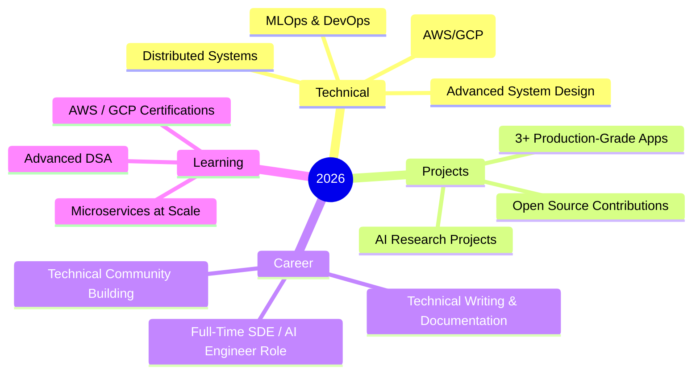

<div align="center">


<br/>

[](https://git.io/typing-svg)

<br/>

<p>
  <a href="https://github.com/saiprasad367">
    
  </a>
  <a href="https://www.linkedin.com/in/saiprasad2523/">
    
  </a>
  <a href="mailto:saiprasad2523@gmail.com">
    
  </a>
  <a href="https://leetcode.com/u/saiprasad2518/">
    
  </a>
</p>

<p>
  
  
</p>

</div>

---


## ⚡ About Me

```typescript
const SaiPrasad: Engineer = {
  name:       "SaiPrasad Chindam",
  role:       "Software Engineer / GenAI Engineer",
  location:   "Hyderabad, India 🇮🇳",
  education:  "B.Tech CSE (AI & ML) @ CMR College of Engineering & Technology",
  cgpa:       "8.05 / 10",

  currentFocus: [
    "🤖  Production-ready GenAI systems & LLM API integration",
    "☁️  Cloud-native architecture on Microsoft Azure",
    "⚙️  Scalable backend services with FastAPI / Node.js",
    "🔬  Human-in-the-loop AI workflows & ML inference pipelines",
  ],

  dsaProgress: "280+ LeetCode problems solved",

  philosophy: `"Engineering is not just about writing code.
               It's about designing systems that survive reality."`,
};
```

<br/>

> 🎯 **Currently seeking** roles in **Software Engineering · AI/GenAI Engineering · Full-Stack Development**
> where I can ship reliable, high-impact products that scale.

---

## 🛠️ Tech Stack

<div align="center">

### 👨‍💻 Languages


### 🎨 Frontend


### ⚙️ Backend & APIs


### 🤖 AI & ML


### 🗄️ Databases


### ☁️ Cloud & DevOps


</div>

---

## 🚀 Featured Projects

<div align="center">

| Project | Stack | Highlights |
|---|---|---|
| **🧠 SiliconMind** | React · TypeScript · Python · FastAPI · XGBoost | FPGA design optimization — 92% ML accuracy, real-time Recharts dashboards, multi-turn AI chat, GitHub Actions CI/CD |
| **⚡ Shortify** | React · Node.js · MongoDB · Redis · Docker | Scalable URL Shortener SaaS — Base62 encoding, Redis caching cut latency 200ms→50ms, Jest integration tests |
| **🧬 SmartBioGPT** | React · TypeScript · Node.js · Firebase · Supabase | AI bioinformatics assistant — UniProt + AlphaFold + DrugBank APIs, real-time streaming, RBAC auth |
| **🎓 EduBridge AI** | React · Azure OpenAI · Azure Speech · Cosmos DB | Voice-first GenAI learning platform — STT→AI→TTS pipeline, adaptive learning loop, ML analytics |

</div>

---

### 🧠 SiliconMind — AI-Driven FPGA Design Optimization

> **Problem:** Manual FPGA optimization is slow, error-prone, and cycles through long re-synthesis loops.
> **Solution:** An end-to-end ML platform that ingests Vivado synthesis reports and auto-generates optimization recommendations.

- Trained **XGBoost/MLP ensemble** on synthesis report features — achieved **92% prediction accuracy**
- Integrated tabular **Q-Learning RL agent** for iterative design-space exploration
- Built **FastAPI** backend handling ML inference, synthesis log parsing, and structured REST delivery
- Designed **interactive Recharts dashboards** (168 LUTs · 0.085W power · 6.23ns critical path)
- Implemented **multi-turn AI chat** with Context API state management and streaming response rendering
- Deployed on Vercel with **GitHub Actions CI/CD pipeline**

<p>
  <a href="https://silicon-mind.vercel.app/"></a>
  <a href="https://github.com/saiprasad367/SILICON_MIND"></a>
</p>

---

### ⚡ Shortify — Scalable URL Shortener SaaS

> High-performance URL management platform built for scale, analytics, and reliability.

- **Base62 encoding** for collision-free short URL generation at scale
- **Redis caching** layer reducing redirect response time from **200ms → 50ms (75% improvement)**
- **MongoDB schema** with compound indexing for high-read throughput
- **Recharts analytics dashboard** tracking click-through rates and traffic metrics
- Containerized with **Docker**, deployed via **GitHub Actions CI pipeline**
- Comprehensive **Jest integration tests** covering redirect, auth, and analytics flows

<p>
  <a href="https://url-shortener-14yj.vercel.app/"></a>
  <a href="https://github.com/saiprasad367/URL_Shortener"></a>
</p>

---

### 🧬 SmartBioGPT — AI Bioinformatics Research Assistant

> ChatGPT-style interface for exploring gene, protein, and drug interaction data in real time.

- **Multi-turn conversational UI** in React/TypeScript with real-time streaming responses
- **Redux-style message state management** with persistent history and optimistic UI updates
- **Express.js API gateway** integrating UniProt · AlphaFold · DrugBank REST APIs with rate limiting
- **Chart.js visualizations** for protein structure and drug interaction data
- **Firebase RBAC authentication** with protected React Router routes
- Modular backend deployed on Vercel for scalable API consumption

<p>
  <a href="https://smart-bio-gpt-tau.vercel.app"></a>
  <a href="https://github.com/saiprasad367/SmartBioGPT"></a>
</p>

---

### 🎓 EduBridge AI — Voice-First GenAI Learning Platform

> Cloud-native, voice-first platform delivering personalized, multilingual AI-powered learning.

- End-to-end **Speech-to-Text → Azure OpenAI → Text-to-Speech** pipeline for hands-free interaction
- **Adaptive learning loop**: Explain → Ask → Analyze → Re-explain, dynamically personalized per student
- **ML scoring models** tracking clarity, confidence, and improvement trends (Azure ML)
- Persistent student profiles in **Cosmos DB**, modular microservices on **Microsoft Azure**
- Emphasis on **human-in-the-loop AI** and responsible learning analytics

---

## 💼 Experience

### Edunet Foundation (Microsoft & AICTE) — AI on Azure Intern
**May 2025 – Jun 2025 · Remote**

- Developed and deployed full-stack AI applications on **Microsoft Azure**, integrating Azure OpenAI and Azure Speech Services into React frontends with Node.js/Express backends
- Built RESTful API endpoints with **role-based access control**; collaborated in Agile/Scrum sprints with weekly deliverables, code reviews, and CI/CD pipelines via GitHub Actions
- Earned **Microsoft AI on Azure Co-branded Certificate** — AI fundamentals, Azure cloud services, full-stack AI development

---

## 🏆 Achievements & Certifications

<div align="center">

| 🥇 Achievement | Organization | Date |
|---|---|---|
| **1st Place** — CHARGE 2026 24-Hour Hackathon (120+ teams) | Sreenidhi Institute of Science & Technology | Mar 2026 |
| **2nd Place** — HackspireX, HAVANA'26 National Level Tech Fest (100+ teams) | GITAM Deemed University | Mar 2026 |
| **National Final Round Qualifier** — Ingenium Hackathon, Pragyan 2026 | NIT Tiruchirappalli | Feb 2026 |
| **Participant** — Vibrant National Level 48-Hour Hackathon | Geethanjali Institute of Science & Technology | Jan 2026 |
| **Code Clash** — IIT Hyderabad DSA Competition | Elan & nVision, IIT Hyderabad | Jan 2026 |
| **ISEA ISAP CTF 2026** — Cybersecurity Challenge | IIT Madras | Jan 2026 |
| **Deutsche Börse Cybersecurity Challenge** | Elan & nVision, IIT Hyderabad | Jan 2026 |
| **Hack4Delhi** — National Hackathon | NSUT Delhi via Unstop | Dec 2025 |

</div>

<br/>

**Certifications:**
`Salesforce Certified Agentforce Specialist` · `Microsoft AI on Azure (AICTE + Edunet)` · `Scaler High-Level System Design (OTT Scale)` · `Cisco — Introduction to Modern AI` · `Cisco — Introduction to Cybersecurity` · `Cisco — Introduction to Data Science` · `HackerRank — SQL · Java · Problem Solving` · `Hexart — AI Advanced / Beginner / Foundation` · `Deloitte — Technology & Cybersecurity Virtual Simulations`

---

## 🎓 Education

```
CMR College of Engineering & Technology          Sep 2023 – Present
B.Tech, Computer Science & Engineering (AI & ML)         CGPA: 8.05/10
Hyderabad, India

Coursework: Data Structures & Algorithms · Operating Systems · DBMS
            Computer Networks · Distributed Systems · Full-Stack Development

Shivani Junior College                           2021 – 2023
Intermediate (MPC)                               97.7% — Top Performer

Sri Siddhartha High School                       2021
SSC / Grade 10                                   Strong Academic Foundation
```

---

## 📊 GitHub Analytics

<div align="center">


</div>

### 📈 Contribution Graph

<div align="center">
  
</div>

### 🏆 GitHub Trophies

<div align="center">
  
</div>

---

## 🧩 Problem Solving

<div align="center">


</div>

**Focus Areas:** Data Structures · Algorithms · System Design · Graph Problems · Dynamic Programming

`Easy ✅` · `Medium 🟡 Active` · `Hard 🔴 Advancing`

---

## 🎯 2026 Goals


```mermaid
mindmap
  root((2026))
    Technical
      Advanced System Design
      Cloud Architecture (AWS/GCP)
      MLOps & DevOps
      Distributed Systems
    Projects
      3+ Production-Grade Apps
      Open Source Contributions
      AI Research Projects
    Career
      Full-Time SDE / AI Engineer Role
      Technical Community Building
      Technical Writing & Documentation
    Learning
      AWS / GCP Certifications
      Advanced DSA
      Microservices at Scale
```

---

## 🌐 Skills Architecture


```mermaid
graph TD
    A[SaiPrasad Chindam] --> B[Full-Stack Engineering]
    A --> C[GenAI & ML Systems]
    A --> D[Cloud & DevOps]
    A --> E[System Design]

    B --> B1[React · Next.js · TypeScript]
    B --> B2[Node.js · Express · FastAPI]
    B --> B3[PostgreSQL · MongoDB · Redis]

    C --> C1[Azure OpenAI · Speech Services]
    C --> C2[XGBoost · Scikit-learn · ML Pipelines]
    C --> C3[LLM API Integration · Streaming]

    D --> D1[Microsoft Azure]
    D --> D2[Docker · GitHub Actions · CI/CD]
    D --> D3[Vercel · Microservices]

    E --> E1[Distributed Systems]
    E --> E2[REST API Design · Rate Limiting]
    E --> E3[RBAC · Auth · Secure Backends]

    style A fill:#0ea5e9,stroke:#0284c7,color:#fff
    style B fill:#6366f1,stroke:#4f46e5,color:#fff
    style C fill:#8b5cf6,stroke:#7c3aed,color:#fff
    style D fill:#0284c7,stroke:#0369a1,color:#fff
    style E fill:#059669,stroke:#047857,color:#fff
```

---

## 🌐 Connect With Me

<div align="center">

<a href="https://github.com/saiprasad367">
  
</a>
<a href="https://www.linkedin.com/in/saiprasad2523/">
  
</a>
<a href="mailto:saiprasad2523@gmail.com">
  
</a>
<a href="https://leetcode.com/u/saiprasad2518/">
  
</a>
<a href="https://drive.google.com/file/d/10LhlwbpqALxGnD-2bXHtN2xce9y1zsqX/view?usp=sharing">
  
</a>

</div>

---

<div align="center">


<sub>Built with precision by SaiPrasad Chindam · Hyderabad, India 🇮🇳</sub>

</div>
